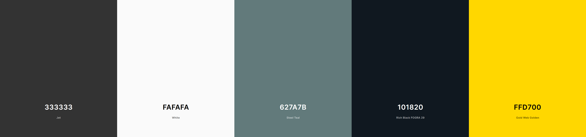

# Ricardo's mediterranean restaurant 

## Ricardo's is a classy but family friendly restaurant that offers traditional and modern mediterranean dishes with friendly and professional service ##

# UX #

## User Experience ##

 ### Client Goals: ###

  * To have an online presence.
  * To display the food and drinks offer on the site.
  * To increase traffic to the physical site.
  * Increase online bookings via contact forms.
  * Increase our social media presence via social media links. 
  * Simple to navigate around
  * Not cluttered with too much information

### First Time Visitor Goals:
 
  * I want to easely find the food and drinks offer and prices.
  * I want to be able to access and download their menu for future use.
  * I want to find out opening times and location.
  * I want to quicly and easely book a table or get in touch with the restaurant.

### Returning and frequent Visitor Goals:

  * As a returning visitor, I want to find out about new products.
  * As a returning visitor, I want to be able to book a table.

___

## Structure ##

 The website is comprised of three pages(home page, gallery page and contact page), all accessible from the navigation menu.

  All Pages on the website have:
    
 * Navigation bar consisting of the restaurant logo linked to the home page and a navigation menu with colour change on hover for good user experince.
 * Hero section with an image of well known mediterranean food ingredients with contrasting colors to keep the text readable.
 * Footer with social media links with colour change on hover for good user experince and copyright information.

      
### Home Page

 #### The home page consists of seven sections:

 * Navigation bar to easily and quicly access all the pages.
 * Hero section with Ricardo's logo with a simple and clean design. 
 * Welcome section with information about who we are and what we offer.
 * Menus section where the menus can easily be clicked to be seen and downloaded.
 * Reviews section to backup how good the restaurant is.
 * Information section that consists of contact, opening times and a booking link that takes the customer to the contact page.
 * Footer section.

#### Gallery page

 The Gallery page consists of four sections:

 * Navigation bar to easily and quicly access all the pages.
 * Hero image with "gallery" message. 
 * Food and drinks photos section.
 * Footer section.

    
#### Contact us Page

 The contact us page consists of four  sections:

 * Navigation bar to easily and quicly access all the pages.
 * Hero image with "Contact us" message. 
 * contact information with email, phone number and address, and a contact form so the user can send an email with a message.
 * Footer section.

___

# Design

