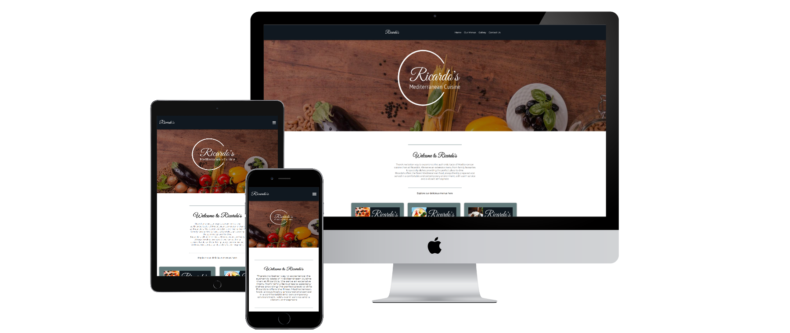

# Ricardo's mediterranean restaurant 
### Ricardo's restaurant is my first web project and it aims to be a fully functional and responsive website. 

You can check the website here [Ricardo's](https://ricardolmmatos.github.io/Ricardos-mediterranean-restaurant/)

___

## User Experience (UX)

### Initial Discusion
Ricardo's is a classy but family friendly restaurant that offers traditional and modern mediterranean dishes with friendly and professional service.
The website provides users with information about the restaurant food and drinks offer. It's targeted toward people who are looking for high quality food and service.
Users can use the website the get information about products, prices, events and to make a booking or get in touch.

 ### Client Goals: 

  * To have an online presence.
  * To display the food and drinks offer on the website.
  * To increase traffic to the physical site.
  * Increase online bookings via contact forms.
  * Increase our social media presence via social media links. 
  * Simple to navigate around
  * Not cluttered with too much information

### First Time Visitor Goals:
 
  * I want to easely find the food and drinks offer and prices.
  * I want to be able to access and download their menu for future use.
  * I want to find out opening times and location.
  * I want to quicly and easely book a table or get in touch with the restaurant.

### Returning and frequent Visitor Goals:

  * As a returning or frequent visitor, I want to find out about new products and events.
  * As a returning or frequent visitor, I want to be able to book a table or get in touch.

___
## Structure ##

 ### The website is comprised of three pages(home page, gallery page and contact page), all accessible from the navigation menu.

 #### Common sections:
    
 * Navigation bar consisting of the restaurant logo on the left side linked to the home page and a navigation menu on the right side with links to Home page, book a table (linked to contact page for now), gallery page, menus (with a drop down menu that shows all the menus that open the desired menu with the  option to download it ) and a contact page.
 The navbar is fully responsive and changes to a burger menu on smaller screens still ofering the same links as the desktop.
 All the links change colour on hover for good user experince.

  |                       **Full NavBar**                        |                           **Mobile Navbar**                           |
  | :----------------------------------------------------------: | :-------------------------------------------------------------------: |
  |   |      |
  |                      **Menus dropdown**                       |                          **Mobile Dropdown NavBar**                  |
  |  |             |

 * Hero section with an image of well known mediterranean food ingredients with contrasting colors to keep the text readable.
 The text changes on every page with the home page showing Ricardo's logo, the gallery showing the message "Gallery" and the contact page shwiong the message "Contact us" for easy user navigation.

 
 * Footer is simple and easy to understand with social media links and copyright information, the links change colour from green to white on hover for better user experience.

 

### Home Page

 The home page consists of seven sections:

 * Navigation bar to easily and quicly access all the pages.
 * Hero section with Ricardo's logo with a simple and clean design. 
 * Welcome section with information about who we are and what we offer.
 * Menus section where the menus can easily be clicked to be seen and downloaded.
 * Reviews section to backup how good the restaurant is.
 * Information section that consists of contact, opening times and a booking link that takes the customer to the contact page.
 * Footer section.

### Gallery page

 The Gallery page consists of four sections:

 * Navigation bar to easily and quicly access all the pages.
 * Hero image with "gallery" message. 
 * Food and drinks photos section.
 * Footer section.

    
### Contact us Page

 The contact us page consists of four  sections:

 * Navigation bar to easily and quicly access all the pages.
 * Hero image with "Contact us" message. 
 * contact information with email, phone number and address, and a contact form so the user can send an email with a message.
 * Footer section.
 ___

## Future Implementations.

 * Use Javascript to automaticly go back to the home page after submiting a form.
 * A functional booking system for the online bookings.
 * To turn the phone number and email links on contact us sections clickable.
  ___

## Design

### Colour Scheme

For the colours I have used some market research to see what colours are trending and personal preference, I wanted to give the website a fine dininig yet warm and family friend place feeling.

### Typography

I have have combined a classic type of font for the logo and Welcome message header to give the user a welcoming feeling and more modern fonts for the headers and body to be user frindly.
My preference for fallback font is serif.

All fonts used are from Google :

* [Great Vibes](https://fonts.google.com/specimen/Great+Vibes?query=great+vibes) is used for the logo and Welcome message on the page.
* [Montserrat](https://fonts.google.com/specimen/Montserrat) is used for the most of the body text on the page.
* [Playfair Display](https://fonts.google.com/specimen/Playfair+Display?query=playfair) is used for the headers text on the page.

### Imagery 
I have used diferent sources for images and to create the logo and favicon, all free to use or with owners consent.
#### Logo 

When creating the logo I wantedto create a logo that would be easily associated with food but elegant and modern so I've used the "great Vibes" font for the Ricardo's word which is in my opinion easy to associate with food, specialy Italian food. For the rest of the logo I have used the "Montserrat" font which is  clean and modern.
 ___
 
 ___
  * To create the logo I have used Adobe express:
 [Adobe Express](https://www.adobe.com/express/create/logo)
 * For the hero image I have used Pixabay:
 [Pixabay](https://pixabay.com)
* To create the menus I have used Postermywall website:
 [Postermywall](https://www.postermywall.com/)
 * For the gallery images I've used La Torre restaurant photos with the owners consent
 [La Torre restaurant](https://www.latorrerestaurant.com/)
 * To create the favicon I have used Gimp software
 [https://www.gimp.org/]

 

### Wireframes

I have used Balsamic wireframe software to create my initial wireframes, for desktop, laptop, tablet and mobile.
The finished product came very close to the initial concept.

| Desktop Index                                                                 | Desktop Contact                                                   |
| --------------------------------------------------------------------- | ------------------------------------------------------------------------- |
|  |  |

| Mobile Index                                                                 | Mobile Contact                                                     |
| --------------------------------------------------------------------- | ------------------------------------------------------------------------- |
|  |  |

 * [Desktop home page wireframe](/assets/readme-images/desktop-home.png)
 * [Desktop gallery page wireframe](/assets/readme-images/desk-gallery.png)
 * [Desktop contact page wireframe](/assets/readme-images/desk-contact.png)
 * [Tablet home page wireframe](/assets/readme-images/tab-home.png)
 * [Tablet gallery page wireframe](/assets/readme-images/tab-gallery.png)
 * [Tablet contact page wireframe](/assets/readme-images/tab-contact.png)
 * [Mobile home page wireframe](/assets/readme-images/mob-home.png)
 * [Mobile gallery page wireframe](/assets/readme-images/mob-gallery.png)
 * [Mobile contact page wireframe](/assets/readme-images/mob-cont.png)
 ___

## Technologies Used
* [HTML5](https://developer.mozilla.org/en-US/docs/Glossary/HTML5) - building, structuring and presenting project
* [CSS3](https://developer.mozilla.org/en-US/docs/Web/CSS) - website styling
* [Balsamiq](https://balsamiq.com) - wireframes
* [Adobe Express](https://www.adobe.com/express/create/logo) - to design the logo
* [Convertio](https://convertio.co/jpeg-webp/) - to convert images to webp
* [VScode](https://code.visualstudio.com) - code editing
* [GIT](https://git-scm.com/), [GitHub](https://github.com/) - tracking, storing, hosting project
* [Chrome DevTools](https://developer.chrome.com/docs/devtools) - inspecting and debugging code
___

## Testing

___
## Deployment

The Live link is [Link to page]

#### To deploy the project:
1. In the [GitHub repository](https://github.com/), navigate to the *Settings* tab.
2. Once in Settings, navigate to the *Pages* tab on the left hand side.
3. In the *Build and deployment* section under *Branch*, select the **master** branch and click *Save*.
4. Once the master branch has been selected, the page will be automatically refreshed and a display indicates the successful deployment and the link to the address.

#### To run the website on a local machine:
1. Go to the [Ricardo's mediterranean restaurant repo](https://github.com/RicardoLMMatos/Ricardos-mediterranean-restaurant/)
2. Click on the green *Code* button and *Download ZIP*
3. Extract the ZIP file on your local machine
4. Run the *index.html* file in a browser

#### To clone the repo:
1. Go to the [Ricardo's mediterranean repo](https://github.com/RicardoLMMatos/Ricardos-mediterranean-restaurant)
2. Click the *Code* button to the right of the screen and copy the *HTTPs* link there
3. Open a GitBash terminal and navigate to the directory where you want to locate the clone
4. Type `git clone` and paste the copied *HTTPs* link, press the *Enter* key to begin the clone process

___

## Credits
### Code
 All my code was written based on what I have learned from [CodeInstitute Full Stack Developer Course](https://codeinstitute.net/ie/full-stack-software-development-diploma/) and [W3schools](https://www.w3schools.com/)
 * CSS flexbox was based on what I have learned from [css-tricks.com](https://css-tricks.com/snippets/css/a-guide-to-flexbox/)
 * Burger Menu was implemented based on an example from [W3schools](https://www.w3schools.com/)

### Media Content
* [Google Fonts](https://fonts.google.com) - fonts
* [FontAwesome](https://fontawesome.com) - icons
* [La Torre restaurant](https://www.latorrerestaurant.com/) - gallery images
* [Pixabay](https://pixabay.com) - free Images
* [Adobe Express](https://www.adobe.com/express/create/logo) - logo
* [Fontawsome](https://fontawesome.com/) - icons
* [Gimp](https://www.gimp.org/) -favicon
* [Postermywall](https://www.postermywall.com/) - menus
* [Coolors](https://coolors.co/) - colour pallete

### A personal thank you to:
* My tutor Callum Jones for his help with course content and guidance 
* My mentor Rahul for his guidance
* My good friend William Hurst for his his advise 
* Brent Towers for letting me use his food images
* My course collegues for helping me with any questions I had